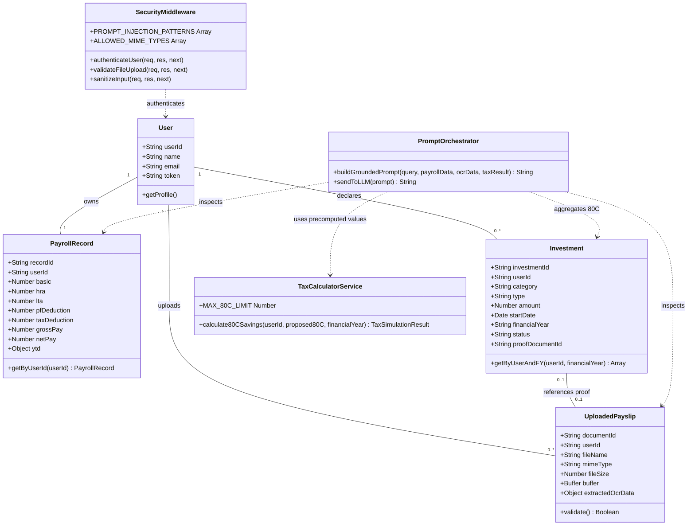

# Low-Level Design (LLD) Specification: AI Financial Wellness Assistant

## 1. Executive Summary
This document outlines the class structures, entity models, database schemas, relationship mappings, and security middleware logic for the Node.js/Express AI Financial Wellness Assistant. 

### Key Architectural Enhancements:
* **Normalized Investment Tracking:** Dedicated `Investment` model supporting `startDate`, `financialYear`, and proof verification states (`DECLARED` vs. `VERIFIED`).
* **Multi-Year Financial Scope:** Dynamic aggregation of `currentDeclared` 80C contributions scoped to specific active financial years.
* **Separation of Concerns:** Hard separation between deterministic financial math, database persistence, security middleware, and generative prompt orchestration.

---

## 2. Updated Low-Level Class Diagram



---

## 3. Entity Models & Database Schema

### 3.1 `User` Model
```javascript
class User {
  constructor({ userId, name, email, token }) {
    this.userId = userId;   // Primary Key (e.g., "emp_101")
    this.name = name;
    this.email = email;
    this.token = token;     // Bearer Token for Session Isolation
  }
}
```

### 3.2 `PayrollRecord` Model
```javascript
class PayrollRecord {
  constructor({ userId, basic, hra, lta, pfDeduction, taxDeduction, grossPay, netPay, ytd }) {
    this.userId = userId;         // Foreign Key to User
    this.basic = basic;
    this.hra = hra;
    this.lta = lta;
    this.pfDeduction = pfDeduction;
    this.taxDeduction = taxDeduction;
    this.grossPay = grossPay;
    this.netPay = netPay;
    this.ytd = {                  // Year-To-Date aggregates
      gross: ytd.gross,
      taxPaid: ytd.taxPaid,
      pfContributed: ytd.pfContributed
    };
  }
}
```

### 3.3 `Investment` Model (Normalized Multi-Year Ledger)
```javascript
class Investment {
  constructor({ investmentId, userId, category, type, amount, startDate, financialYear, status, proofDocumentId }) {
    this.investmentId = investmentId; // Primary Key
    this.userId = userId;               // Foreign Key to User
    this.category = category;           // '80C', '80D', '80CCD', etc.
    this.type = type;                   // 'ELSS', 'PPF', 'LIC', 'EPF'
    this.amount = amount;               // Numerical value
    this.startDate = startDate;         // e.g., '2026-04-15'
    this.financialYear = financialYear; // e.g., '2026-2027'
    this.status = status;               // 'DECLARED' | 'PROOF_SUBMITTED' | 'VERIFIED'
    this.proofDocumentId = proofDocumentId || null; // Foreign Key to UploadedPayslip
  }
}
```

#### SQL Schema Specification
```sql
CREATE TABLE investments (
    investment_id VARCHAR(50) PRIMARY KEY,
    user_id VARCHAR(50) NOT NULL REFERENCES users(user_id),
    category VARCHAR(20) NOT NULL, -- '80C', '80D'
    investment_type VARCHAR(50) NOT NULL, -- 'ELSS', 'PPF', 'EPF'
    amount DECIMAL(10, 2) NOT NULL,
    start_date DATE NOT NULL,
    financial_year VARCHAR(9) NOT NULL, -- e.g., '2026-2027'
    status VARCHAR(20) DEFAULT 'DECLARED', -- 'DECLARED' | 'VERIFIED'
    proof_document_id VARCHAR(50) NULL,
    created_at TIMESTAMP DEFAULT CURRENT_TIMESTAMP
);

-- Index for high-performance multi-year user lookups
CREATE INDEX idx_user_fy_category ON investments(user_id, financial_year, category);
```

### 3.4 `UploadedPayslip` Model
```javascript
class UploadedPayslip {
  constructor({ documentId, userId, fileName, mimeType, fileSize, extractedOcrData }) {
    this.documentId = documentId;
    this.userId = userId;         // Foreign Key to User
    this.fileName = fileName;
    this.mimeType = mimeType;     // Restricted to application/pdf, image/png, image/jpeg
    this.fileSize = fileSize;     // Max 5 MB Limit
    this.uploadedAt = new Date();
    this.extractedOcrData = extractedOcrData || {}; // Parsed fields from Document
  }
}
```

### 3.5 `TaxSimulationResult` Model (Value Object)
```javascript
class TaxSimulationResult {
  constructor({ currentDeclared80C, proposedAdditional, eligibleDeduction, estimatedSavings, financialYear }) {
    this.financialYear = financialYear;
    this.currentDeclared80C = currentDeclared80C;
    this.proposedAdditional = proposedAdditional;
    this.eligibleDeduction = eligibleDeduction; // Min(proposed, 150000 - current)
    this.estimatedSavings = estimatedSavings;   // Deterministic 20% calculation
    this.disclaimer = "Simplified Old Tax Regime estimate for the selected financial year.";
  }
}
```

---

## 4. Aggregation Logic & Dynamic 80C Service

```javascript
// Service logic computing active currentDeclared80C dynamically
class InvestmentService {
  static getCurrentDeclared80C(userId, financialYear = "2026-2027") {
    // Queries normalized Investment ledger filtered by active financial year
    const activeInvestments = investmentDatabase.filter(inv => 
      inv.userId === userId && 
      inv.financialYear === financialYear &&
      inv.category === '80C' &&
      ['DECLARED', 'VERIFIED'].includes(inv.status)
    );

    return activeInvestments.reduce((sum, inv) => sum + inv.amount, 0);
  }
}
```

---

## 5. Entity Relationship & Constraint Summary

| Entity Pair | Relationship Type | Cardinality | Constraint / Security Safeguard |
|---|---|---|---|
| **User → PayrollRecord** | One-to-One (`1 : 1`) | Mandatory | Bound strictly by `userId`. An employee can access only their own record. |
| **User → Investment** | One-to-Many (`1 : N`) | Optional | Filtered by `userId` and `financialYear`. Supports multi-year tracking. |
| **User → UploadedPayslip** | One-to-Many (`1 : N`) | Optional | In-memory upload scoped to `req.user.userId`. Validated by `uploadGuard`. |
| **Investment → UploadedPayslip** | Zero/One-to-One (`0..1 : 0..1`) | Optional | Links investment declarations to proof files via `proofDocumentId`. |
| **TaxCalculator → PromptOrchestrator** | Value Object Input | Read-Only | Dynamic aggregate output passed into LLM prompt as immutable JSON context. |
